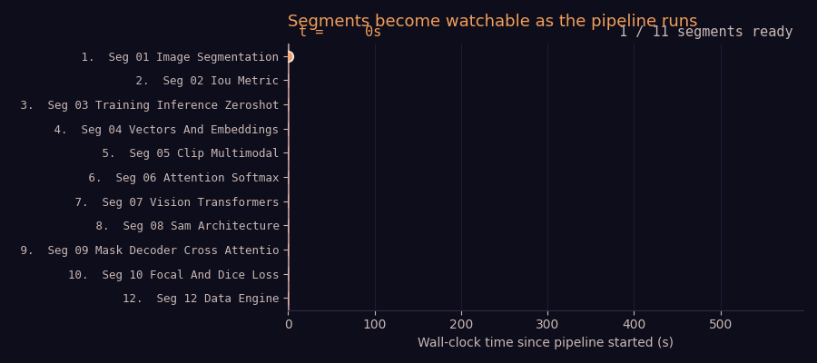

# Anvya — Research papers → 3Blue1Brown-style explainer videos

Turn any research-paper PDF into a narrated, Manim-animated explainer video.
The pipeline reads the paper, writes a 3B1B-style lesson plan, generates Manim
code per segment, renders and syncs each segment to AI narration, and stitches
them into a final MP4 — and starts handing you finished segments while the rest
of the video is still being rendered.

<p align="center">
  
</p>

> The clip above is segment 1 of the SAM paper (Segment Anything, Kirillov et
> al.) generated end-to-end from the PDF — 3× speed for the README.

---

## Why this is interesting

**Pipeline-parallel codegen → render → sync** means each segment moves through
the three stages independently. As soon as a segment's code is written, its
render is queued; the moment its render finishes, audio sync starts. The
final concat happens once at the end. The practical effect: **segment 1 is
ready to watch ~10× sooner than it would be if every stage ran in bulk.**

<p align="center">
  
</p>

```
                              BEFORE              AFTER
Time to first watchable:      ≈ 19 min            ≈ 8 min
Total wall time:              ≈ 20 min            ≈ 22 min
Codegen prompt-cache hit:     —                   ≈ 70–80 %
```

Measured on `resources/SAM.pdf` → "Beginner" tier (12 segments, with audio).
Numbers above are from the optimization branch's CI runs.

---

## Quick start

### 1. Prerequisites

```bash
# Python 3.10+ (macOS ships python3, not a bare `python` — use python3
# for the venv step below, or alias it)
python3 --version

# Homebrew (macOS only, if you don't have it)
/bin/bash -c "$(curl -fsSL https://raw.githubusercontent.com/Homebrew/install/HEAD/install.sh)"
# Prompts for your password — run it in an actual terminal, not piped
# through another tool. Follow its printed "Next steps" to add brew to PATH.

# ffmpeg for audio/video processing
brew install ffmpeg          # macOS
# or: apt-get install ffmpeg # Debian/Ubuntu

# cairo + pango + pkg-config — required on macOS for `pip install manim`
# to build its pycairo / manimpango dependencies. Without these the pip
# install fails with "Pkg-config for machine host machine not found" or
# similar meson/cairo errors.
brew install cairo pango pkg-config   # macOS
# or: apt-get install libcairo2-dev libpango1.0-dev pkg-config # Debian/Ubuntu

# LaTeX — required for Manim's MathTex/Tex (any equation rendering).
# Without this, every scene with an equation fails at render time with
# `FileNotFoundError: [Errno 2] No such file or directory: 'latex'`.
brew install --cask mactex   # macOS, full TeX Live (~5GB, needs sudo — run
                              # `sudo installer -pkg <path-to-pkg> -target /`
                              # directly if `brew install --cask mactex` says
                              # "already installed" but `which latex` still
                              # fails, since the cask's own installer step
                              # can silently fail without an interactive sudo
                              # prompt)
# or: brew install --cask basictex for a smaller (~100MB) install, then
#     `eval "$(/usr/libexec/path_helper)"` and `tlmgr install dvisvgm` for
#     the extra packages Manim needs
# or: apt-get install texlive-full  # Debian/Ubuntu

# Manim for rendering
pip install manim
# or follow https://docs.manim.community/en/stable/installation.html
```

### 2. Install Python dependencies

Two paths — use whichever you already have:

```bash
# Option A — uv (recommended; what we use)
uv venv && source .venv/bin/activate
uv pip install -r requirements.txt
uv pip install -e .

# Option B — vanilla pip
python3 -m venv .venv && source .venv/bin/activate
pip install -r requirements.txt
pip install -e .
```

The `pip install -e .` step is required — without it, `python -m
research_viz...` fails with `ModuleNotFoundError: No module named
'research_viz'`, since the package lives under `src/` and isn't on the
Python path until installed.

### 3. Configure API keys

Copy the template and fill in your key:

```bash
cp .env.example .env
# Edit .env and paste your OpenRouter key
```

`.env` needs at minimum:

```env
OPENROUTER_API_KEY=sk-or-v1-…
```

That's it for LLM calls. All of them (explanation, judge, codegen) and
Gemini TTS go through OpenRouter. Get a key at
https://openrouter.ai/keys — pay-as-you-go, no monthly minimum.

Two OpenRouter gotchas worth knowing up front:
- OpenRouter lets you cap an individual **API key** with its own spending
  limit, separate from your account's overall balance. If you hit
  `402 Payment Required: ... adjust the key's total limit`, that's the
  key's own cap, not your account balance — raise it at
  `https://openrouter.ai/workspaces/default/keys/<your-key-id>`, not just
  the general credits page.
- Some requests need at least $0.50 in account balance specifically to
  process file (PDF) attachments — a `402 ... requires at least $0.50 in
  balance for files` error means your account balance itself is low, add
  funds at https://openrouter.ai/settings/credits.

`OPENAI_API_KEY` is **required**, not optional, if you're using the Manim
RAG lookups (used during code-fix retries in Manim codegen) — it's *not*
only for switching TTS back to OpenAI. The vector DB itself is gitignored
(not shipped in the repo — see step 3.5 below), and even querying an
existing local vector DB re-embeds the search query via OpenAI's
`text-embedding-3-large`, so this key is needed at query time, not just
when rebuilding the index. Get one at https://platform.openai.com — note
that a fresh OpenAI account/project may need billing explicitly enabled
under **Settings → Organization → Billing → Overview** (not just a card on
file) before embedding calls will succeed.

### 3.5. Build the Manim RAG vector DB (required, one-time)

```bash
python -m research_viz.preprocessing.build_manim_index
```

Scrapes the Manim docs (cached after the first run), chunks them, and
embeds ~3,900 chunks via OpenAI (`text-embedding-3-large`) into a local
ChromaDB at `data/manim_docs/vector_db/chroma_db/`. Costs roughly $0.50–1
in OpenAI credits and takes a few minutes. Without this step, Manim
codegen retries will hit `RAG error: Collection [manim_docs] does not
exist` — non-fatal (retries still happen, just with less context to
self-correct from), but noticeably reduces the success rate of
error-fix retries.

### 4. Run

```bash
python -m research_viz.manim_generator.pdf_to_manim_pipeline \
  --pdf-path resources/SAM.pdf \
  --difficulty easy
```

The pipeline-parallel fast path is on by default for single-language English
runs. Output lands in
`src/research_viz/manim_generator/output/<paper>_<difficulty>_en/`:

- `final_video.mp4` — the stitched final video
- `debug_ready_segments/order{NN}_*.mp4` — per-segment files, written the
  moment each becomes watchable (great for streaming UI demos)
- `run_metrics.json` — per-stage timing, cache hit rate, cost estimate
- `<paper>_explanation.json` — the structured 3B1B lesson plan
- `audio_beats/beat_timeline.json` — per-beat TTS timing
- `<paper>_animation.py` — the generated Manim code

---

## Difficulty tiers

```
easy    →  10–14 segments, 350–600 words/segment, prereqs taught from scratch
medium  →   4–6  segments, 150–300 words/segment, full notation
hard    →   2–3  segments,  80–180 words/segment, terse, expert-level
```

```bash
# CLI flag picks the tier directly
python -m research_viz.manim_generator.pdf_to_manim_pipeline \
  --pdf-path <paper.pdf> --difficulty easy
```

Each tier maps to a different model lineup in `config.yaml`:

| Tier   | Explanation                  | Codegen                  | Judge       |
| ------ | ---------------------------- | ------------------------ | ----------- |
| easy   | gemini-2.5-pro                | gemini-2.5-pro            | gemini-2.5-flash |
| medium | gemini-3.1-flash-lite        | claude-sonnet-4.5        | gemini-2.5-flash |
| hard   | gemini-3.1-flash-lite        | deepseek-v3.2            | (skipped)   |

Override any of these in `config.yaml` (root) or `config/dev.yaml` (per-profile).
Note that `config/dev.yaml` (the default profile when `ANVAYA_PROFILE` is
unset) can override values from the root `config.yaml` — e.g. it currently
sets a longer `manim.timeout` than you might expect by reading the root
file alone. Check both files if a setting doesn't seem to be taking effect.

---

## Pipeline flow

```
PDF
  │
  ▼
[ 1 ] Explanation        Pro LLM reads the PDF and writes a structured
                         3B1B lesson plan: opening question, running
                         example, segments × { intuition + technical +
                         narration script }. Judge loop verifies quality.
  │
  ▼
[ 2 ] Pipeline-parallel codegen → render → sync (per segment)
       │
       ├── Audio (parallel)       Gemini TTS narrates every beat;
       │                          per-segment readiness signals downstream.
       │
       ├── Codegen (parallel)     LLM writes the Manim animation for the
       │                          segment, with beat-timed run_times. RAG
       │                          retrieves Manim docs on execution errors.
       │
       ├── Render (parallel)      Manim renders the scene as soon as its
       │                          codegen finishes.
       │
       └── Sync   (parallel)      ffmpeg single-pass: speed-adjust the
                                  video to match audio duration, mux.
                                  Result: a per-segment MP4 that's
                                  immediately watchable.
  │
  ▼
[ 3 ] Stitch              Concat all per-segment MP4s → final_video.mp4
```

The pipeline is **resumable.** If a run is interrupted, re-running with
the same args picks up where it left off — anything already on disk
(explanation JSON, scene metadata, audio beats, rendered scenes) is
reused.

---

## Web app (beta)

There's also a browser UI for uploading a PDF and watching segments
stream onto the page as they're rendered.

```bash
# Terminal 1 — backend (FastAPI + SSE)
cd anvaya_website/apps/api
pip install -r requirements.txt        # only once
python main.py

# Terminal 2 — frontend (static React-via-CDN prototype)
cd app
python -m http.server 5500

# Then open http://localhost:5500
```

Flow: upload a PDF → progress page shows five circles (Explanation / Audio /
Codegen / Render / Sync) lighting up for segment 1 in real time → other
segments appear as "Preparing segment N…" cards → as soon as any segment is
done the page auto-scrolls to an inline `<video>` that starts playing it →
when it ends, it auto-advances to the next ready segment.

The `app/` directory uses Babel-standalone (no build step), so you can edit
`.jsx` files and reload.

---

## Books → video (chapters)

The same engine also turns whole **book chapters** into a coherent *series* of
explainer videos — not just one-off papers. It pulls the table of contents from
the PDF (embedded TOC or LLM-parsed), writes a shared **series bible** — running
example, notation glossary, visual style — so every chapter video feels like
part of one course, then runs each chapter through the same
explanation → codegen → render → sync pipeline.

```bash
# Chapter 1 of a book, medium tier
python -m research_viz.book_generator.book_pipeline \
  --book-pdf resources/MyBook.pdf \
  --chapters 1 \
  --difficulty medium
```

`--chapters "1,3,5"` picks specific chapters; `--chapters 0` does the whole
book. Chapters render in parallel by default. Output lands per chapter under
`output/books/<book_title>/ch_NN_*/` — each with its extracted `chapter.pdf`,
`explanation.json`, `audio_beats/`, and `final_video.mp4` — alongside a shared
`series_bible.json`.

| Flag           | Description                                       | Default      |
| -------------- | ------------------------------------------------- | ------------ |
| `--book-pdf`   | Path to the book PDF                              | required     |
| `--chapters`   | Comma-separated chapters, or `0` for all          | `"1"`        |
| `--difficulty` | `easy` / `medium` / `hard` (same tiers as papers) | `medium`     |
| `--skip-bible` | Reuse a series bible already on disk              | `false`      |
| `--skip-video` | Stop after explanations — skip rendering          | `false`      |
| `--no-parallel`| Process chapters one at a time                    | parallel on  |

Full reference — chapter-detection strategies, supported book formats, output
layout — lives in
[`src/research_viz/book_generator/README.md`](src/research_viz/book_generator/README.md).

---

## Configuration

`config.yaml` at the repo root carries the defaults. `config/{dev,staging,prod}.yaml`
overlay on top (selected via `ANVAYA_PROFILE`, default `dev`). Common knobs:

```yaml
llm:
  route_sort: throughput        # OpenRouter picks the fastest endpoint
  prompt_cache: true            # auto-add cache_control on system prompts
  judge_reasoning_effort: null  # "low" | "medium" | "high" to opt in

audio:
  tts_model: google/gemini-3.1-flash-tts-preview
  voice: Leda
  provider: openrouter
  max_workers: 4

video:
  quality: l                    # l/m/h/k → 480p/720p/1080p/2160p
  sync_mode: segment            # vs "beat"  (frame-perfect, experimental)
  max_speed_change: 0.3         # cap on speed adjust during audio sync

manim:
  timeout: 120
  max_workers: 4
  max_retries: 3                # per-segment retries on codegen failure
```

ENV overrides also work for any key — e.g. `ANVAYA_VIDEO__QUALITY=h`.

---

## Project layout

```
src/research_viz/
├── manim_generator/
│   ├── pdf_to_manim_pipeline.py        # Main orchestrator + pipelined runner
│   ├── pdf_explanation_generator.py    # PDF → structured 3B1B lesson
│   ├── scene_validator.py              # Static fixes on generated Manim code
│   └── prompts/                        # System prompts for each stage
├── audio_generator/
│   └── beat_sync_tts.py                # StreamingBeatGenerator + classic mode
├── book_generator/                     # Book-to-video pipeline (chapters)
├── providers/
│   ├── llm_provider.py                 # Provider ABC + LLMResponse
│   └── openrouter_provider.py          # OpenRouter impl w/ retries + caching
├── pipeline/
│   ├── checkpoint.py                   # Resume support
│   └── run_metrics.py                  # Per-stage timing + cost
├── translation/                        # Multilingual fan-out
├── preprocessing/                      # Manim docs scraping + RAG build
└── schemas/                            # Pydantic models

anvaya_website/apps/api/                # FastAPI backend (SSE + segments)
app/                                    # React-via-CDN prototype frontend

scripts/
├── analyze_pipeline_timeline.py        # Gantt + time-to-first-watchable from logs
├── build_staircase_gif.py              # README streaming-staircase animation
└── profile_hard_mode.py                # End-to-end latency profiler
```

---

## Troubleshooting

**`OpenRouter error 401`** — `OPENROUTER_API_KEY` is unset or revoked. Re-source
your shell after editing `.env`.

**`Model tts-1 does not exist`** — a stale `config/dev.yaml` overriding
`audio.tts_model`. Remove the override; default is the OpenRouter Gemini TTS.

**`Address already in use` on `:8000`** — old backend still running.
`lsof -i :8000 -t | xargs kill -9`.

**No segments under `debug_ready_segments/`** — codegen failed all 3 attempts
for that segment. Check `run_metrics.json` for which stage errored.

**`FileNotFoundError: ... 'latex'`** — Manim's `MathTex`/`Tex` shell out to a
real LaTeX install (`latex`/`pdflatex`), which isn't the same as installing
Manim itself. See Prerequisites above (`mactex` or `basictex` via Homebrew).

**`RAG error: Collection [manim_docs] does not exist`** — the Manim RAG
vector DB hasn't been built yet (it's gitignored, not shipped in the repo).
Run `python -m research_viz.preprocessing.build_manim_index`. If you see
`Missing credentials ... OPENAI_API_KEY` instead, that key isn't set in
`.env`; if you see `openai.RateLimitError: insufficient_quota`, your OpenAI
account (not OpenRouter) has no billing enabled — see step 3 above.

**`OpenRouter 402 ... requested up to 65536 tokens, but can only afford
N`** — your OpenRouter API key's own credit limit is capped; this is
unrelated to (and often mistaken for) low account balance. Raise the
limit on the key itself at
`https://openrouter.ai/workspaces/default/keys/<key-id>`.

**Output directory keeps regenerating a new series bible every run** — the
book pipeline caches the bible/explanation/segments against a stable
output directory derived from the PDF filename
(`output/books/<pdf-stem>/`). If you're on an older checkout that still
renames this directory to a book-title-derived slug after generating the
bible, that rename breaks the cache lookup on every subsequent run. Update
to a version where `book_pipeline.py` uses one stable directory for the
whole lifetime of a book.

---

## Authors

- **Lakshya Gupta** — [LinkedIn](https://www.linkedin.com/in/lakshyaadm/)
- **Anannya Popat** — [LinkedIn](https://www.linkedin.com/in/anannya-popat/)

GitHub Pages: https://chaosadmstudent.github.io/research-paper-graphviz/

## License

MIT.
